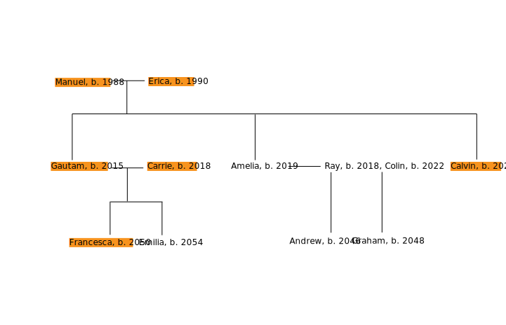

<link href="stylesheets/GitHub2.css" rel="stylesheet"></link>

# Dexign the Future Project 2

Three Generation Personas
Dan Tasse

## What world do they live in?

The Shell Mountains scenario. An extension of the current status quo. Those with power tend to slowly gain more power, and authority becomes more concentrated in a few cities. Social mobility is stifled, though the US government tries to create the illusion that society is more mobile than it is. Central planning leads the world to slowly transition to natural gas, then to renewable resources, before climate change gets too radically out of hand.

## The Family

(work in progress)

- Manuel (b. 1988) - professional (what?), somewhat conservative in that he doesn't mind preserving the status quo. Met Erica via OkCupid. Always wanted to have kids, but as they didn't think they could, they adopted Gautam.
- Erica (b. 1990) - successful and idealistic. Direct focus on career led her to be promoted to manager at a small technology company; became pregnant with Amelia soon after they adopted Gautam. 
- Gautam (b. 2015, adopted by Manuel and Erica 2018) - from a rural north Indian village. Active, enjoyed sports, a natural leader.
- Carrie (b. 2018)
- Amelia (b. 2019)
- Ray (b. 2018)
- Colin (b. 2022)
- Calvin (b. 2021)
- Francesca (b. 2050)
- Emilia (b. 2054)
- Andrew (b. 2046)
- Graham (b. 2048)

